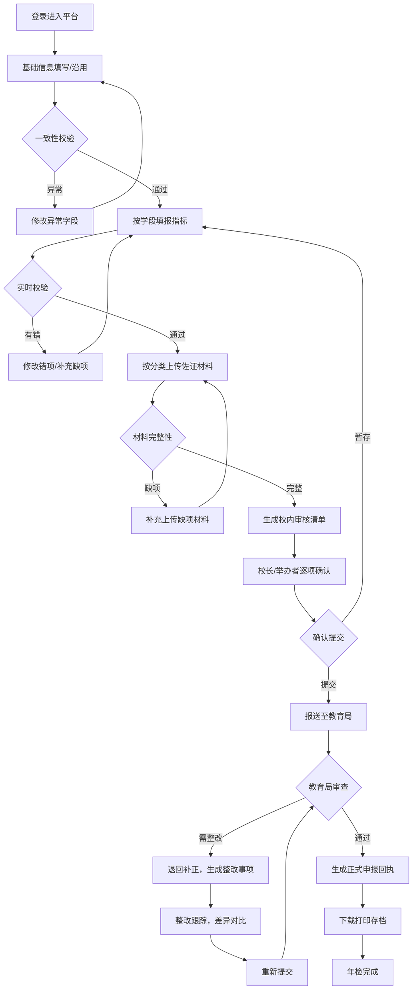

## 1. 产品概述

面向民办学校举办者、校长和年检经办人的 Web 年检申报平台，将"填报、佐证、整改、回执"全流程系统化、标准化，提升年检效率，降低申报错误率，适用于县区教育局统一组织年检时集中使用。

- 核心解决问题：民办学校年检流程繁琐、材料零散、缺项错项多、整改跟踪困难、存档不规范
- 目标用户：民办学校举办者、校长、年检经办人、教育主管部门审查人员

---

## 2. 核心功能

### 2.1 用户角色

| 角色 | 核心权限 |
|------|----------|
| 学校举办者 | 查看整体进度、签署确认、导出回执 |
| 校长 | 审核清单、确认申报、查看整改事项 |
| 年检经办人 | 填报信息、上传材料、处理整改、跟踪进度 |
| 教育局审查员 | 退回补正、填写审查意见、确认通过 |

### 2.2 功能模块

1. **基础信息页**：学校基本信息、办学许可证、法人信息、沿用上年度数据
2. **指标填报页**：按学段切换表单、指标逐项填报、一致性校验
3. **材料上传页**：按条目分类上传证照、财务、师资、安保等佐证材料
4. **整改跟踪页**：整改事项列表、完成状态跟踪、差异对比
5. **进度中心页**：整体进度可视化、提醒通知、校内审核清单
6. **结果回执页**：申报回执生成、审查意见查看、打印存档

### 2.3 页面详情

| 页面名称 | 模块名称 | 功能描述 |
|----------|----------|----------|
| 基础信息 | 学校信息卡片 | 展示学校名称、统一社会信用代码、办学许可证号等基础信息 |
| 基础信息 | 办学许可证信息 | 许可证编号、举办者、校长、办学范围、有效期限，可沿用上年度 |
| 基础信息 | 法人与校舍信息 | 法人代表、校舍建筑面积、产权性质、收费项目备案信息 |
| 基础信息 | 一致性校验提示 | 关键字段与许可证原件比对，异常字段高亮提醒 |
| 指标填报 | 学段切换器 | 小学/初中/高中/中职/幼儿园/培训，切换对应年检表单 |
| 指标填报 | 指标分类导航 | 办学条件、师资队伍、教育教学、财务管理、安全管理5大类 |
| 指标填报 | 指标填报表单 | 逐项填写，支持数字、文本、选择、日期多种类型 |
| 指标填报 | 实时校验 | 必填校验、范围校验、数值合理性校验、错项即时提示 |
| 材料上传 | 分类文件列表 | 证照类、财务类、师资类、安保类、其他类5大分类 |
| 材料上传 | 拖拽上传区 | 支持多文件拖拽上传，PDF/图片格式，单文件大小限制 |
| 材料上传 | 上传进度 | 显示每个文件的上传进度、预览、删除操作 |
| 材料上传 | 缺项提醒 | 未上传必传材料分类红色标识，逐项提示 |
| 整改跟踪 | 整改事项卡片 | 事项描述、要求完成日期、当前状态、责任人 |
| 整改跟踪 | 状态流转 | 待整改→整改中→已提交→已通过/再整改 |
| 整改跟踪 | 差异对比 | 退回补正前vs修改后的字段差异高亮对比 |
| 整改跟踪 | 教育局意见 | 审查意见记录、意见附件下载、对话式回复 |
| 进度中心 | 流程进度条 | 6大节点可视化进度：填报→佐证→校内审核→报送→审查→完成 |
| 进度中心 | 提醒中心 | 缺项提醒、错项提醒、临近截止日期倒计时提醒 |
| 进度中心 | 校内审核清单 | 负责人逐项勾选确认清单，电子签名确认 |
| 进度中心 | 时间轴 | 申报各节点操作记录时间轴展示 |
| 结果回执 | 申报回执 | 正式回执PDF预览，含编号、学校信息、申报日期、电子签章 |
| 结果回执 | 审查结果 | 通过/有条件通过/需整改/不予通过结论展示 |
| 结果回执 | 打印存档 | 浏览器打印样式优化，支持A4纸存档打印 |
| 结果回执 | 历史记录 | 历年年检结果历史查询 |

---

## 3. 核心流程

### 3.1 主流程描述

年检经办人登录后，首先在基础信息页确认或沿用上年度学校基础信息，系统自动完成关键字段一致性校验。随后根据学校学段进入对应指标填报页，逐项填报5大类年检指标，系统实时校验数据合理性。完成填报后进入材料上传页，按分类上传所有佐证材料，系统提示缺项。填报和材料完整后，进入进度中心，系统生成校内审核清单，由校长逐项确认后提交。教育局审查后，如有整改事项进入整改跟踪页，经办人根据意见整改并查看差异对比，整改完成后重新提交。审查通过后在结果回执页查看正式回执，下载打印存档。

### 3.2 流程图

---

## 4. 用户界面设计

### 4.1 设计风格

**整体风格：政务专业型 + 现代简约**
- **主色调**：深空蓝 `#1e40af`（权威、专业、教育属性）
- **辅助色**：青绿色 `#0d9488`（通过、完成状态）+ 琥珀橙 `#f59e0b`（提醒、待办状态）+ 玫红 `#e11d48`（错误、整改状态）
- **中性色**：冷灰系 `#f8fafc / #e2e8f0 / #64748b / #1e293b`，保证可读性和层次感
- **按钮风格**：圆角 8px，主按钮渐变填充，次要按钮描边，hover 阴影微浮起
- **字体方案**：
  - 标题：Noto Serif SC（思源宋体，庄重正式感）
  - 正文：Noto Sans SC（思源黑体，清晰易读）
  - 数字/表单：JetBrains Mono（等宽字体，数据对齐）
- **布局风格**：顶部固定导航 + 左侧子导航 + 内容区卡片网格，信息密度适中
- **图标风格**：Lucide 线性图标，2px 描边，统一 20px 尺寸，配合语义化颜色

### 4.2 页面设计概览

| 页面名称 | 模块名称 | UI 元素设计 |
|----------|----------|-------------|
| 基础信息 | 信息卡片组 | 分组卡片布局，信息标签-值两列对齐，异常字段带红色边框+说明气泡 |
| 基础信息 | 沿用数据按钮 | 醒目渐变色按钮，点击弹出确认弹窗，展示上年度数据预览 |
| 指标填报 | 分类侧边栏 | 左侧竖向步骤条，已完成打勾、当前高亮、未锁定灰色 |
| 指标填报 | 指标表单 | 表单标签+输入框+校验提示三行结构，错误输入框红色边框震动效果 |
| 材料上传 | 分类文件柜 | 卡片式分类文件夹，封面图标+数量徽标，点击展开文件列表 |
| 材料上传 | 拖拽区域 | 虚线边框区域，hover 时边框变实、背景浅蓝，拖拽进入放大动画 |
| 整改跟踪 | 状态徽章 | 胶囊形彩色徽章，流转时带色条渐变动画 |
| 整改跟踪 | 差异对比 | 左右分栏，删除线红色+下划线绿色，差异行浅底色高亮 |
| 进度中心 | 环形进度 | SVG 环形进度图，中心百分比，渐变描边带流动光效 |
| 进度中心 | 提醒面板 | 右上角通知铃铛，未读数量红色徽标，下滑展开提醒列表 |
| 进度中心 | 审核清单 | 可勾选列表，勾选时左侧图标打勾动画，全部勾选后确认按钮激活 |
| 结果回执 | 回执预览 | A4 纸张拟态效果，阴影+页边距，电子签章右下角压印效果 |
| 结果回执 | 打印按钮 | 悬浮固定右下，点击触发打印，同时触发 confetti 动画（通过时） |

### 4.3 响应式设计

- **桌面优先**：1440px 宽度为设计基准，内容区最大宽度 1200px 居中
- **平板适配（768-1024px）**：左侧子导航折叠为顶部 Tab，卡片网格由4列降为2列
- **手机适配（<768px）**：顶部导航精简Logo+菜单，页面全宽单列布局，表单标签改为顶置标签
- **触摸优化**：按钮最小点击区 44px × 44px，表单输入框触控友好的 padding

### 4.4 动效与交互

- 页面加载：主体内容 600ms 渐入 + 从下往上位移 20px，卡片依次 stagger 50ms
- 表单校验：错误字段轻微 shake 动画（左右抖动 3 次），成功提交绿色对勾扩散
- 材料上传：拖拽进入时容器 scale 1.02 + 阴影加深，上传完成后卡片滑入
- 状态变更：徽章颜色渐变过渡 300ms，环形进度 SVG stroke-dashoffset 平滑过渡
- 打印页面：CSS @media print 隐藏导航、按钮等非内容元素，调整边距至 A4 标准

---
