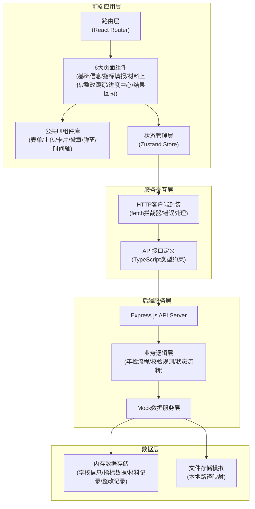
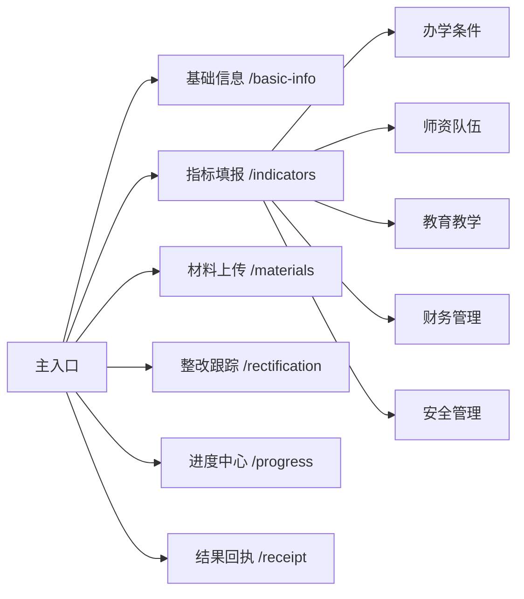
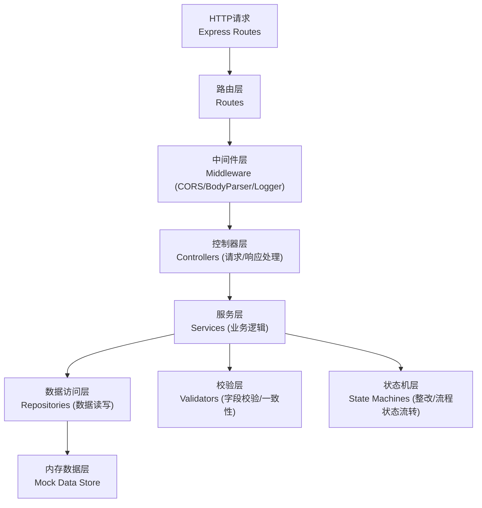
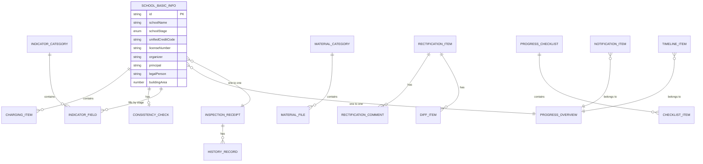

## 1. 架构设计

### 1.1 系统分层架构图



### 1.2 页面导航结构



---

## 2. 技术栈说明

| 层级 | 技术选择 | 版本 | 用途说明 |
|------|----------|------|----------|
| **前端框架** | React | ^18.2.0 | 组件化开发、Hooks API |
| **编程语言** | TypeScript | ^5.3.0 | 类型安全、IDE智能提示 |
| **构建工具** | Vite | ^5.0.0 | 快速开发构建、HMR热更新 |
| **CSS框架** | Tailwind CSS | ^3.4.0 | 原子化样式、快速开发UI |
| **路由管理** | React Router DOM | ^6.21.0 | 客户端路由、页面导航 |
| **状态管理** | Zustand | ^4.4.0 | 轻量级全局状态、持久化 |
| **图标库** | Lucide React | ^0.312.0 | 线性图标库、语义化图标 |
| **后端框架** | Express.js | ^4.18.0 | RESTful API 服务 |
| **后端语言** | TypeScript | ^5.3.0 | 全栈类型一致 |
| **文件上传** | Multer | ^1.4.5 | 后端文件上传处理中间件 |
| **跨域处理** | CORS | ^2.8.5 | 前后端跨域通信 |

---

## 3. 路由定义

### 3.1 前端路由表

| 路由路径 | 页面名称 | 对应组件 | 说明 |
|----------|----------|----------|------|
| `/` | 入口重定向 | Redirect | 默认重定向至基础信息页 |
| `/basic-info` | 基础信息页 | BasicInfoPage | 学校信息、许可证、法人、校舍 |
| `/indicators` | 指标填报页 | IndicatorsPage | 按学段切换表单，5大类指标 |
| `/materials` | 材料上传页 | MaterialsPage | 5大类佐证材料上传 |
| `/rectification` | 整改跟踪页 | RectificationPage | 整改事项、状态流转、差异对比 |
| `/progress` | 进度中心页 | ProgressPage | 流程进度、提醒、审核清单、时间轴 |
| `/receipt` | 结果回执页 | ReceiptPage | 回执预览、打印、历史记录 |

### 3.2 后端API路由

| HTTP方法 | 路径 | 功能 |
|----------|------|------|
| GET | `/api/school-info` | 获取学校基础信息 |
| PUT | `/api/school-info` | 更新学校基础信息 |
| POST | `/api/school-info/apply-last-year` | 沿用上年度信息 |
| GET | `/api/indicators/:schoolStage` | 获取指定学段年检指标 |
| PUT | `/api/indicators/:schoolStage` | 提交指标填报数据 |
| GET | `/api/indicators/validate` | 指标数据校验接口 |
| GET | `/api/materials/categories` | 获取材料分类列表 |
| GET | `/api/materials/list/:categoryId` | 获取指定分类文件列表 |
| POST | `/api/materials/upload/:categoryId` | 上传材料文件 |
| DELETE | `/api/materials/:fileId` | 删除材料文件 |
| GET | `/api/rectifications` | 获取整改事项列表 |
| PUT | `/api/rectifications/:id/status` | 更新整改事项状态 |
| GET | `/api/rectifications/:id/diff` | 获取差异对比数据 |
| GET | `/api/progress/overview` | 获取整体进度概览 |
| GET | `/api/progress/notifications` | 获取提醒通知列表 |
| GET | `/api/progress/checklist` | 获取校内审核清单 |
| PUT | `/api/progress/checklist/submit` | 提交校内审核清单 |
| GET | `/api/progress/timeline` | 获取操作时间轴 |
| GET | `/api/receipt/current` | 获取当前年检回执 |
| GET | `/api/receipt/history` | 获取历史年检记录 |
| POST | `/api/receipt/submit` | 正式提交申报 |

---

## 4. 共享类型定义

### 4.1 核心数据类型

```typescript
// shared/types/index.ts

export type SchoolStage = 'primary' | 'junior' | 'senior' | 'vocational' | 'kindergarten' | 'training';

export type RectificationStatus = 'pending' | 'in_progress' | 'submitted' | 'passed' | 'retry';

export type InspectionResult = 'passed' | 'conditional_passed' | 'need_rectify' | 'rejected';

export type NotificationType = 'missing' | 'error' | 'deadline' | 'info';

export interface SchoolBasicInfo {
  id: string;
  schoolName: string;
  schoolStage: SchoolStage;
  unifiedCreditCode: string;
  licenseNumber: string;
  organizer: string;
  principal: string;
  legalPerson: string;
  legalPersonIdCard: string;
  businessScope: string[];
  licenseValidFrom: string;
  licenseValidTo: string;
  schoolAddress: string;
  buildingArea: number;
  propertyType: 'owned' | 'leased' | 'cooperative';
  chargingItems: ChargingItem[];
  consistencyCheck: ConsistencyCheckResult;
}

export interface ChargingItem {
  name: string;
  standard: string;
  unit: string;
  approvalNumber: string;
}

export interface ConsistencyCheckResult {
  passed: boolean;
  issues: ConsistencyIssue[];
}

export interface ConsistencyIssue {
  field: string;
  fieldLabel: string;
  currentValue: string;
  expectedValue: string;
  severity: 'warning' | 'error';
  message: string;
}

export interface IndicatorCategory {
  id: string;
  name: string;
  icon: string;
  totalItems: number;
  completedItems: number;
}

export interface IndicatorField {
  id: string;
  categoryId: string;
  label: string;
  type: 'text' | 'number' | 'select' | 'date' | 'textarea' | 'boolean';
  required: boolean;
  placeholder?: string;
  options?: { value: string; label: string }[];
  min?: number;
  max?: number;
  unit?: string;
  validationRules?: ValidationRule[];
  value?: any;
  error?: string;
}

export interface ValidationRule {
  type: 'required' | 'min' | 'max' | 'pattern' | 'custom';
  value?: any;
  message: string;
}

export interface MaterialCategory {
  id: string;
  name: string;
  icon: string;
  required: boolean;
  uploadedCount: number;
  requiredCount: number;
  files: MaterialFile[];
  description: string;
}

export interface MaterialFile {
  id: string;
  categoryId: string;
  name: string;
  size: number;
  type: string;
  uploadTime: string;
  uploader: string;
  status: 'uploaded' | 'checking' | 'passed' | 'rejected';
  previewUrl?: string;
}

export interface RectificationItem {
  id: string;
  title: string;
  description: string;
  suggestion: string;
  deadline: string;
  status: RectificationStatus;
  responsible: string;
  createdAt: string;
  updatedAt: string;
  comments: RectificationComment[];
  diffData?: DiffItem[];
}

export interface RectificationComment {
  id: string;
  author: string;
  role: string;
  content: string;
  createdAt: string;
  attachments?: MaterialFile[];
}

export interface DiffItem {
  field: string;
  oldValue: string;
  newValue: string;
  changed: boolean;
}

export interface ProgressOverview {
  currentStage: number;
  totalStages: number;
  stageNames: string[];
  stageStatuses: ('completed' | 'current' | 'pending')[];
  overallPercentage: number;
  submissionDeadline: string;
}

export interface NotificationItem {
  id: string;
  type: NotificationType;
  title: string;
  message: string;
  read: boolean;
  createdAt: string;
  deadline?: string;
}

export interface ChecklistItem {
  id: string;
  content: string;
  checked: boolean;
  required: boolean;
  remark?: string;
}

export interface TimelineItem {
  id: string;
  time: string;
  action: string;
  operator: string;
  detail: string;
  type: 'info' | 'success' | 'warning' | 'error';
}

export interface InspectionReceipt {
  id: string;
  receiptNumber: string;
  schoolName: string;
  schoolStage: SchoolStage;
  submissionDate: string;
  inspectionYear: string;
  result: InspectionResult;
  resultDescription: string;
  reviewComments: string;
  reviewer: string;
  reviewDate: string;
  electronicSeal: string;
  historyRecords: HistoryRecord[];
}

export interface HistoryRecord {
  year: string;
  result: InspectionResult;
  receiptNumber: string;
  reviewDate: string;
}
```

---

## 5. 服务器架构（后端分层）



### 5.1 后端目录结构

```
api/
├── index.ts                 # Express 服务入口
├── routes/                  # 路由定义
│   ├── schoolInfo.ts
│   ├── indicators.ts
│   ├── materials.ts
│   ├── rectification.ts
│   ├── progress.ts
│   └── receipt.ts
├── controllers/             # 控制器（请求处理）
│   ├── SchoolInfoController.ts
│   ├── IndicatorsController.ts
│   ├── MaterialsController.ts
│   ├── RectificationController.ts
│   ├── ProgressController.ts
│   └── ReceiptController.ts
├── services/                # 服务层（业务逻辑）
│   ├── SchoolInfoService.ts
│   ├── IndicatorsService.ts
│   ├── MaterialsService.ts
│   ├── RectificationService.ts
│   ├── ProgressService.ts
│   └── ReceiptService.ts
├── validators/              # 校验层
│   ├── SchoolInfoValidator.ts
│   └── IndicatorsValidator.ts
├── mock/                    # Mock 数据
│   ├── schoolInfo.ts
│   ├── indicators.ts
│   ├── materials.ts
│   ├── rectification.ts
│   ├── progress.ts
│   └── receipt.ts
└── utils/                   # 工具函数
    ├── response.ts
    ├── validator.ts
    └── storage.ts
```

---

## 6. 数据模型

### 6.1 ER 关系图



### 6.2 核心数据说明

| 数据实体 | 关键字段 | 存储策略 |
|----------|----------|----------|
| 学校基础信息 | 学校名称、学段、信用代码、许可证号、法人、校舍面积 | 单条记录，支持沿用上年度 |
| 年检指标 | 按学段分类，每类20-30个字段，多种数据类型 | 按学段分组存储，值随用户填报实时更新 |
| 佐证材料 | 5大分类，每个分类多个文件，含名称/大小/类型/状态 | 分类文件夹结构，文件元数据记录 |
| 整改事项 | 事项描述、整改建议、截止日期、状态、责任人、差异数据 | 状态机流转，历史操作记录完整 |
| 进度数据 | 6阶段进度、通知、审核清单、时间轴 | 聚合计算生成，时间轴追加式存储 |
| 年检回执 | 回执编号、结论、审查意见、电子签章、历史记录 | 正式提交后生成不可变，历史记录追加 |
